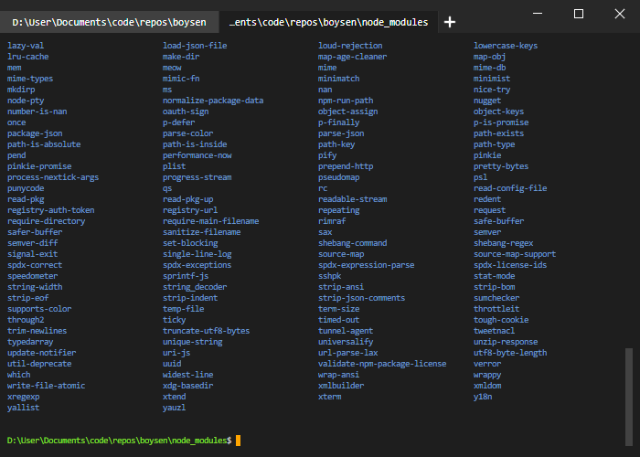

# boysen
Boysen is a modern and lightweight PowerShell emulator built upon electron, xterm.js, and node-pty. It supports multiple sessions through tabs and a few other goodies such as a more compact and bash-like display of file system entries.



## How to build

Clone the repo:
```
git clone https://github.com/avocadianmage/boysen.git
```

Within the root directory of the repo (`/boysen`):
```powershell
npm install
tsc             # Compile TypeScript.
npm run pack    # Ensure native electron modules are built.
```

To run the program:
```
npm start
```

### Dependencies

To build and run the program, you'll need `npm`, which is packaged with [node.js](https://nodejs.org/).

`npm install` requires some tools like Python and the C++ compiler to be present on the system. You can easily install them by running the following command in PowerShell as an administrator:
```
npm install --global --production windows-build-tools
```

You will also need to make sure you have TypeScript for the project to compile:
```
npm install -g typescript
```

## Quick install

You could also download the latest installer binary from the [Releases](https://github.com/avocadianmage/boysen/releases) page.

Note that the executable isn't signed (sorry!)
